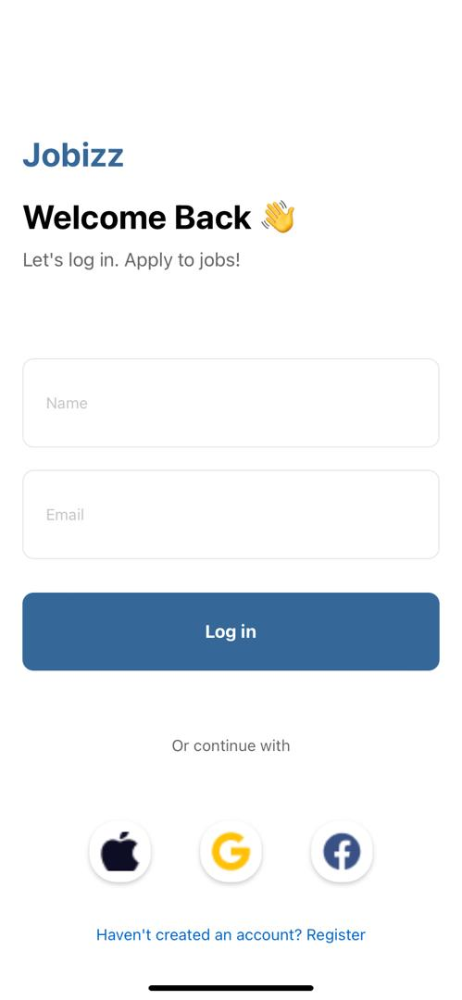

# rn-assignment4-11279787

## APPLICATION COMPONENTS OVERVIEW

### 1. LoginPage
Purpose:

Enables user authentication to access the application securely.
Components and Features:

TextInput: Collects user credentials (username and password).
TouchableOpacity: Initiates the login process with a tap.
ActivityIndicator: Indicates loading status during authentication.
Image: Displays visual elements like logos or background images.

### 2. DashboardPage (Assumed Post-Login Landing Page)
Purpose:

Serves as the initial screen post-login, providing basic user information or navigation options.
Content and Functions:

Typically includes user profile details, navigation links, or summary data.

 ### 3. UserPage
Purpose:

Main interface where authenticated users interact with the core functionalities of the application.
Components and Features:

Header: Displays user profile picture and essential information.
SearchContainer: Offers a search bar for locating specific jobs or content.

SectionTitles: Labels different sections of the page, such as "Featured Jobs" and "Popular Jobs."

FlatList (Featured Jobs): Presents horizontally scrollable cards showcasing featured job details.

ImageBackground/View: Background visual for each job card.

Image: Represents job logos or visual identifiers.

Text: Displays job title, company, salary, and location details.

FlatList (Popular Jobs): Shows vertically scrollable cards listing popular job opportunities.

Image: Displays logos or relevant images for each job.

Text: Includes job title, company, location, and salary information.

TouchableOpacity: Allows users to navigate to comprehensive job listings within each section.

# SCREENSHOT OF PAGES
## Login Page

## User Page
